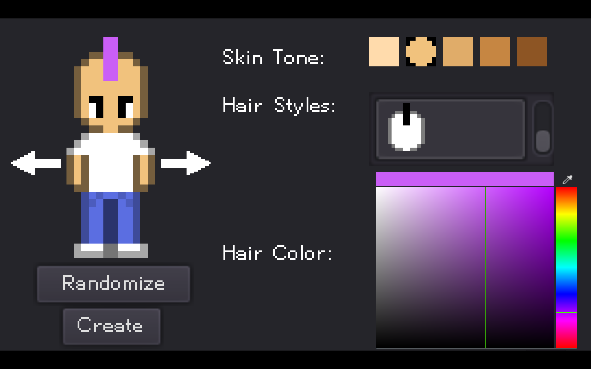
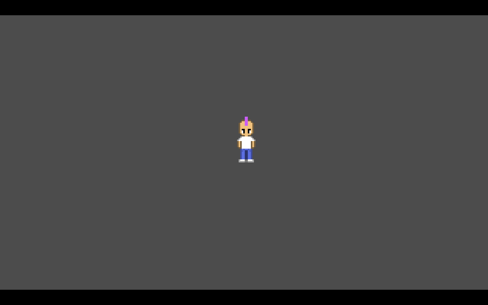

# 2D Character Creator Example
This is a basic 2D chraracter creator made in the Godot Game Engine.  

## Features
You are able to customize to following properties of the character:  
  - skin tone
  - hair style
  - hair color

After creating the character, you will be able to move around and see all the changes you've made in motion.

## The Plan
I don't plan to update this project regularly as I am currently working on my own game. This project is meant to be a template/example for people to refer to while creating their own character creators. However, I might add new features down the road.
